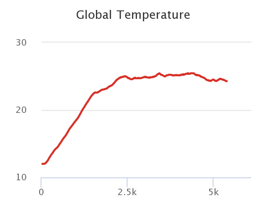
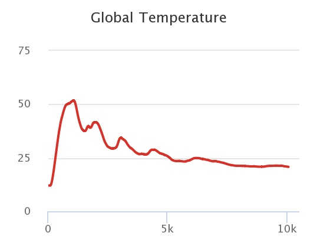
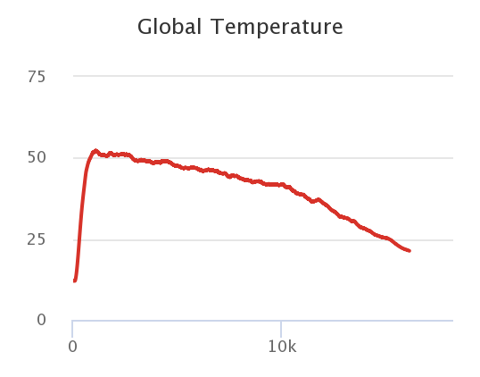

## Комп'ютерні системи імітаційного моделювання
## СПм-22-5, **Лубан Артем Сергійович**
### Лабораторна робота №**1**. Опис імітаційних моделей та проведення обчислювальних експериментів

 

### Варіант 2, модель у середовищі NetLogo:
[Climate Change](http://www.netlogoweb.org/launch#http://www.netlogoweb.org/assets/modelslib/Sample%20Models/Earth%20Science/Climate%20Change.nlogo)

 

### Вербальний опис моделі:
Симуляція потоку енергії на Землі, зокрема, теплової енергії. Вона відображає Землю як трояндово-відтінену, а поверхня планети представлена чорною смугою. Вище смуги розташована блакитна атмосфера, а вгорі - чорний космос. До атмосфери можна додавати хмари та молекули вуглекислого газу (CO2). Молекули CO2 представляють собою парникові гази, які блокують інфрачервоне світло, що випромінюється Землею. Хмари блокують вхідне чи вихідне сонячне випромінювання, впливаючи на нагрівання або охолодження планети.

### Керуючі параметри:
- **sun-brightness** визначає кількість сонячного проміння. [0;5]
- **albedo** визначає скільки сонячної енергії, яка потрапляє на Землю, поглинається. [0;1]

### Кнопки:
- **add cloud** - додати невеличку группу хмар на небі, які блокують сонячне проміння.
- **remove cloud** - видалити невеличку группу хмар на небі, які блокують сонячне проміння.
- **add CO2** - додати 25 молекул CO2 на небі, які блокують IR світло.
- **remove CO2** - видалити 25 молекул CO2 на небі, які блокують IR світло.
- **watch a ray** - дозволяє сконцентрувати увагу на одному сонячному промінні і відстежити його шлях від потрапляння на єкран до можливого перетворення в IR світло і зникнення з єкрану.

### Внутрішні параметри:
- **cloud-speed** швидкість з якою рухается группа хмар.
- **sky-top** лінія розмежування неба і космоса.
- **earth-top** лінія розмежування землі і неба.

### Зовнішні параметри:
- **CO2 amount** - кількість молекул CO2.

### Показники роботи системи:
- **temperature** - температура поверхні землі, зростає коли сонячне проміння потрапляє на землю, знижується коли IR світло виходить с землі, можливість утворення IR світла залежить від температури.

### Примітки:
Температура Землі пов'язана з кількістю тепла в Землі. Чим більше червоних точок ви бачите, тим гаряче.
Якщо сонячний промінь мине хмари і стикається з землею, то з деякою вирогідністью він або відібьеться від неї, або земля поглине тепло від променю.
Якщо тепло у землі стикається з небом, то при температурі середовища вище 20 градусів тепло перетвориться на IR промінь у небі.
Якщо IR промінь не зтикнеться з молекулами CO2, то він покине небо і вилетить у космос.
При налаштуваннях керуючих параметрів за замовчуванням, температура середовища зростає приблизно до 24-26 градусів і тримається на цьому рівні.

### Недоліки моделі:
Якщо додати велику кількість CO2, то температура буде зростати  до нескінчення, тому що IR світло не зможе покинути атмосферу.
Якщо додати велику кількість хмар, то температура буде падати приблизно до 20 градусів і не менше, тому що тепло не перетворюється в IR світло якщо температура середовища нижче 20 градусів.

 

## Обчислювальні експерименти 
### 1. Стабілізування температури.
Керуючі параметри:
- **sun-brightness**: 1
- **albedo**: 0.6
- 0 хмар
- 0 СО2 молекул

<table>
<thead>
<tr><th>Час (ticks)</th><th>Температура</th></tr>
</thead>
<tbody>
<tr><td>0</td><td>12</td></tr>
<tr><td>500</td><td>14,72</td></tr>
<tr><td>1000</td><td>18,43</td></tr>
<tr><td>1500</td><td>22,38</td></tr>
<tr><td>2000</td><td>23,56</td></tr>
<tr><td>2500</td><td>24,78</td></tr>
<tr><td>3000</td><td>24,89</td></tr>
<tr><td>3500</td><td>25,18</td></tr>
<tr><td>4000</td><td>25,16</td></tr>
<tr><td>4500</td><td>25,16</td></tr>
<tr><td>5000</td><td>24,49</td></tr>
</tbody>
</table>

Графік показує, що стабілізування температури можливе і приблизно починаючи з 2000 тиків температура тримається у діапазоні 24-26 градусів.

### 2. Скільки потрібно хмар, щоб проміння не потряпляло до землі?
Керуючі параметри:
- **sun-brightness**: 1
- **albedo**: 0.6
- 0 хмар
- 0 СО2 молекул

<table>
<thead>
<tr><th>Час (ticks)</th><th>Температура</th></tr>
</thead>
<tbody>
<tr><td>0</td><td>12</td></tr>
<tr><td>500</td><td>14,72</td></tr>
<tr><td>1000</td><td>18,43</td></tr>
<tr><td>1500</td><td>22,38</td></tr>
<tr><td>2000</td><td>23,56</td></tr>
<tr><td>2500</td><td>24,78</td></tr>
<tr><td>3000</td><td>24,89</td></tr>
<tr><td>3500</td><td>25,18</td></tr>
<tr><td>4000</td><td>25,16</td></tr>
<tr><td>4500</td><td>25,16</td></tr>
<tr><td>5000</td><td>24,49</td></tr>
</tbody>
</table>

Графік показує, що стабілізування температури можливе і приблизно починаючи з 2000 тиків температура тримається у діапазоні 24-26 градусів.

### 3. Скільки потрібно молекул СО2, щоб IR проміння не могло покинути атмосферу?
Керуючі параметри:
- **sun-brightness**: 1
- **albedo**: 0.6
- 0 хмар
- 0 СО2 молекул

<table>
<thead>
<tr><th>Час (ticks)</th><th>Температура</th></tr>
</thead>
<tbody>
<tr><td>0</td><td>12</td></tr>
<tr><td>500</td><td>14,72</td></tr>
<tr><td>1000</td><td>18,43</td></tr>
<tr><td>1500</td><td>22,38</td></tr>
<tr><td>2000</td><td>23,56</td></tr>
<tr><td>2500</td><td>24,78</td></tr>
<tr><td>3000</td><td>24,89</td></tr>
<tr><td>3500</td><td>25,18</td></tr>
<tr><td>4000</td><td>25,16</td></tr>
<tr><td>4500</td><td>25,16</td></tr>
<tr><td>5000</td><td>24,49</td></tr>
</tbody>
</table>

Графік показує, що стабілізування температури можливе і приблизно починаючи з 2000 тиків температура тримається у діапазоні 24-26 градусів.