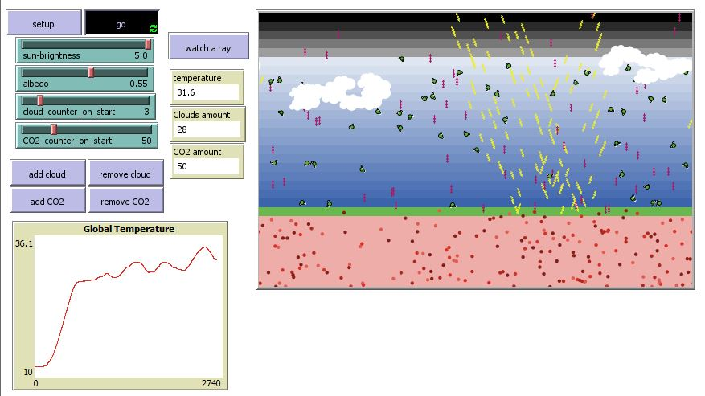

## Комп'ютерні системи імітаційного моделювання
## СПм-22-5, **Лубан Артем Сергійович**
### Лабораторна робота №**2**. Редагування імітаційних моделей у середовищі NetLogo

 

### Варіант 2, модель у середовищі NetLogo:
[Climate Change](http://www.netlogoweb.org/launch#http://www.netlogoweb.org/assets/modelslib/Sample%20Models/Earth%20Science/Climate%20Change.nlogo)

 

### Внесені зміни у вихідну логіку моделі, за варіантом:

**Додати можливість вказівки початкової кількості хмар**
Додав слайдер з назвою cloud_counter_on_start до інтерфейсу.  
Додав цикл repeat у функцію to setup:
'''
repeat cloud_counter_on_start [
  add-cloud
]
'''

**Додати зміну кута падіння нових сонячних промінів протягом часу** (це дозволить імітувати зміну положення сонця протягом доби)  
У процедурі create-sunshine замінив
'''
set heading 160
'''
на
'''
let value ticks / 100 mod 90 
set heading 135 + value 
'''

### Внесені зміни у вихідну логіку моделі, на власний розсуд:

**Здвинути наше імпровізоване сонце до центру**
У процедурі create-sunshine замінив
'''
setxy (random 10) + min-pxcor max-pycor
'''
на
'''
setxy min-pxcor + 20 + (random 10) max-pycor
'''

**Зробити рівномірний розподіл виділення тепла по землі**
У процедурі run-heat замінив
'''
and xcor > 0 and xcor < max-pxcor - 8
...
set heading 40
'''
на
'''
and xcor < max-pxcor
...
set heading 0
'''

**Додати можливість вказівки початкової кількості молекул CO2**
Додав слайдер з назвою CO2_counter_on_start до інтерфейсу.  
Додав цикл repeat у функцію to setup:
'''
repeat CO2_counter_on_start [
  add-CO2
]
'''

Фінальний код моделі та її інтерфейс доступні за [посиланням](Climate Change.nlogo).
 

## Обчислювальні експерименти
*// тут повинен бути наведений опис одного експерименту, за аналогією з першої л/р.* 
### 1. Вплив дисциплінованості водіів на середню швидкість переміщення
