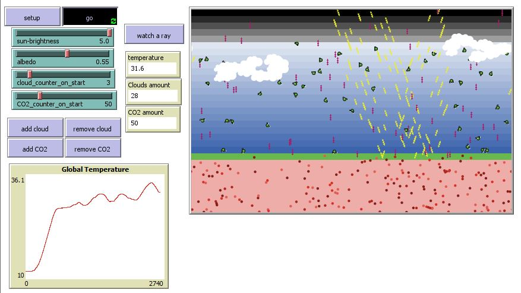

## Комп'ютерні системи імітаційного моделювання
## СПм-22-5, **Лубан Артем Сергійович**
### Лабораторна робота №**2**. Редагування імітаційних моделей у середовищі NetLogo

 

### Варіант 2, модель у середовищі NetLogo:
[Climate Change](http://www.netlogoweb.org/launch#http://www.netlogoweb.org/assets/modelslib/Sample%20Models/Earth%20Science/Climate%20Change.nlogo)

 

### Внесені зміни у вихідну логіку моделі, за варіантом:

**Додати можливість вказівки початкової кількості хмар**
Додав слайдер з назвою cloud_counter_on_start до інтерфейсу.  
Додав цикл repeat у функцію to setup:
<pre>
repeat cloud_counter_on_start [
  add-cloud
]
</pre>

**Додати зміну кута падіння нових сонячних промінів протягом часу** (це дозволить імітувати зміну положення сонця протягом доби)  
У процедурі create-sunshine замінив
<pre>
set heading 160
</pre>
на
<pre>
let value ticks / 100 mod 90 
set heading 135 + value 
</pre>

### Внесені зміни у вихідну логіку моделі, на власний розсуд:

**Здвинути наше імпровізоване сонце до центру**
У процедурі create-sunshine замінив
<pre>
setxy (random 10) + min-pxcor max-pycor
</pre>
на
<pre>
setxy min-pxcor + 20 + (random 10) max-pycor
</pre>

**Зробити рівномірний розподіл виділення тепла по землі**
У процедурі run-heat замінив
<pre>
and xcor > 0 and xcor < max-pxcor - 8
...
set heading 40
</pre>
на
<pre>
and xcor < max-pxcor
...
set heading 0
</pre>

**Додати можливість вказівки початкової кількості молекул CO2**
Додав слайдер з назвою CO2_counter_on_start до інтерфейсу.  
Додав цикл repeat у функцію to setup:
<pre>
repeat CO2_counter_on_start [
  add-CO2
]
</pre>

Фінальний код моделі та її інтерфейс доступні за [посиланням](Climate Change.nlogo).
 

## Обчислювальні експерименти

### 1. Стабілізування температури.
Керуючі параметри:
- **sun-brightness**: 5
- **albedo**: 0,55
- **co2_counter_on_start**: 50
- **cloud_counter_on_start**: 3 

<table>
<thead>
<tr><th>Час (ticks)</th><th>Температура</th></tr>
</thead>
<tbody>
<tr><td>0</td><td>12</td></tr>
<tr><td>500</td><td>23,64</td></tr>
<tr><td>1000</td><td>29,29</td></tr>
<tr><td>1500</td><td>29,35</td></tr>
<tr><td>2000</td><td>30,45</td></tr>
<tr><td>2500</td><td>31,43</td></tr>
<tr><td>3000</td><td>29,88</td></tr>
<tr><td>3500</td><td>30,13</td></tr>
</tbody>
</table>

 
Графік показує, що стабілізування температури можливе і приблизно починаючи з 1000 тиків температура тримається у діапазоні 29-31 градусів.

