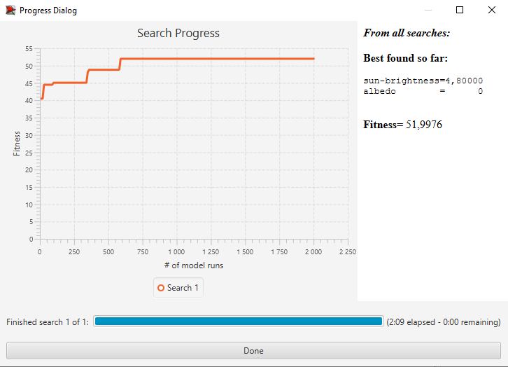

## Комп'ютерні системи імітаційного моделювання
## СПм-22-5, **Лубан Артем Сергійович**
### Лабораторна робота №**3**. Використання засобів обчислювального интелекту для оптимізації імітаційних моделей

 

### Варіант 2, модель у середовищі NetLogo:
[Climate Change](http://www.netlogoweb.org/launch#http://www.netlogoweb.org/assets/modelslib/Sample%20Models/Earth%20Science/Climate%20Change.nlogo)

### Налаштування середовища BehaviorSearch:

**Обрана модель**:
<pre>
C:\Users\user\Desktop\labs\ksim_labs\lab3\Climate Change_orig.nlogo
</pre>
**Параметри моделі** (вкладка Model):  
<pre>
["sun-brightness" [0 0.2 5]]
["albedo" [0 0.05 1]] 
</pre>

Використовувана **міра**:  
Для фітнес-функції було обрано **значення температури** та вказано у параметрі "**Measure**":
<pre>
temperature
</pre>
Температура повинна враховуватися максимальна за весь період симуляції тривалістю, 5000 тактів (адже на кожному такті є своє значення температури), починаючи з 0 такту симуляції.  
Параметр зупинки за умовою ("**Stop if**") не використовувався.
 
Загальний вигляд вкладки налаштувань параметрів моделі:  

**Налаштування цільової функції** (вкладка Search Objective):  
Метою підбору параметрів імітаційної моделі, що описує навколишне середовище, є **максимізація** значення температури – це вказано через параметр "**Goal**" зі значенням **Maximize Fitness**. Тобто необхідно визначити такі параметри налаштувань моделі, у яких температура буде найвища. Нас цікавить температура на останньому кроці, тому що вона буде постійно зростати, тому у параметрі "**Collected measure**", що визначає спосіб обліку значень обраного показника, вказано **AT_FINAL_STEP**.  
Щоб уникнути викривлення результатів через випадкові значення, що використовуються в логіці самої імітаційної моделі, **кожна симуляція повторюється по 10 разів**, результуюче значення розраховується як **середнє арифметичне**.
Загальний вигляд вкладки налаштувань цільової функції:  

**Налаштування алгоритму пошуку** (вкладка Search Algorithm):    
Загальний вид вкладки налаштувань алгоритму пошуку:  

 

### Результати використання BehaviorSearch:
Діалогове вікно запуску пошуку:  

 
Результат пошуку параметрів імітаційної моделі, використовуючи **генетичний алгоритм**:  

 
Результат пошуку параметрів імітаційної моделі, використовуючи **випадковий пошук**:  

### Висновок:
Хоча я і підняв число ітерацій пошуку до 2000 для **випадковий пошук**, але **генетичний алгоритм** все одно зміг знайти параметри для максимальної температури за 5000 тіків краще.